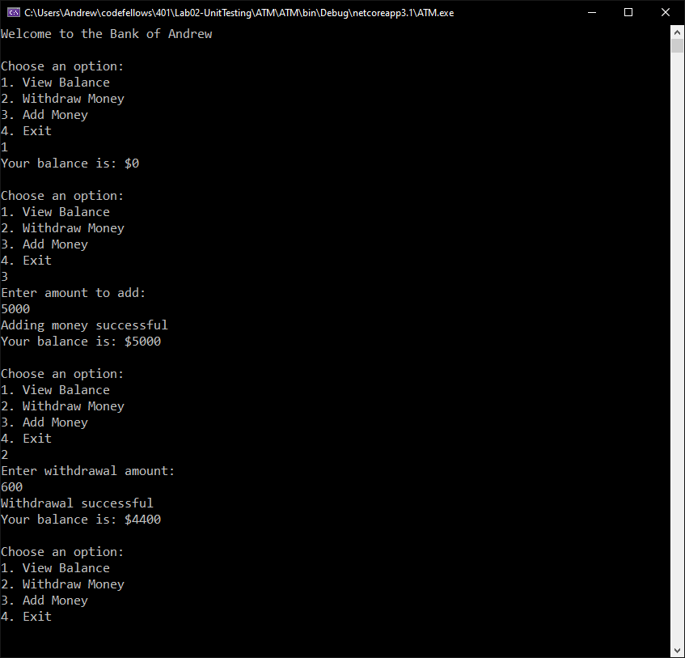

# Lab 2: Unit Testing

## ATM

Lab02-UnitTesting

*Author: Andrew Casper*

----

## Description
This application has the functionality of an Automatic Teller Machine, allowing a user to check a balance, add money to the balance, and perform withdrawals.

---

### Getting Started
Clone this repository to your local machine.

```
$ git clone https://github.com/shifted7/Lab02-UnitTesting.git
```

### To run the program from Visual Studio:
Select ```File``` -> ```Open``` -> ```Project/Solution```

Next navigate to the location you cloned the Repository.

Double click on the ```Lab02-UnitTesting``` directory.

Then select and open ```ATM.sln```

---

### Visuals

#### Application In Action

#### Application Handling Exceptions and End


---

### Change Log
***[The change log will list any changes made to the code base. This includes any changes from TA/Instructor feedback]***  
1.0: *Released with view balance, withdrawal, and add money functionality* - March 18-2020  
